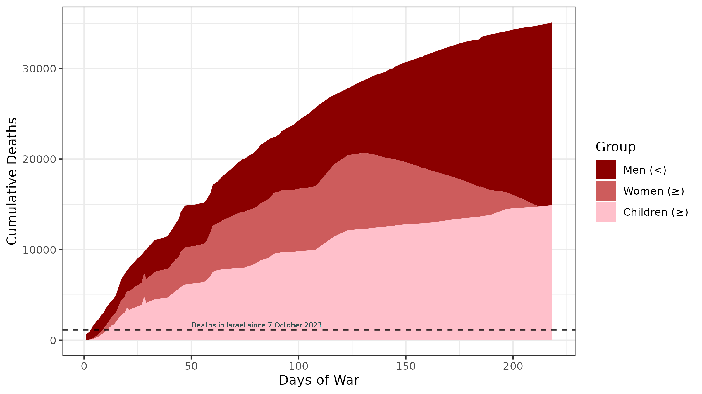
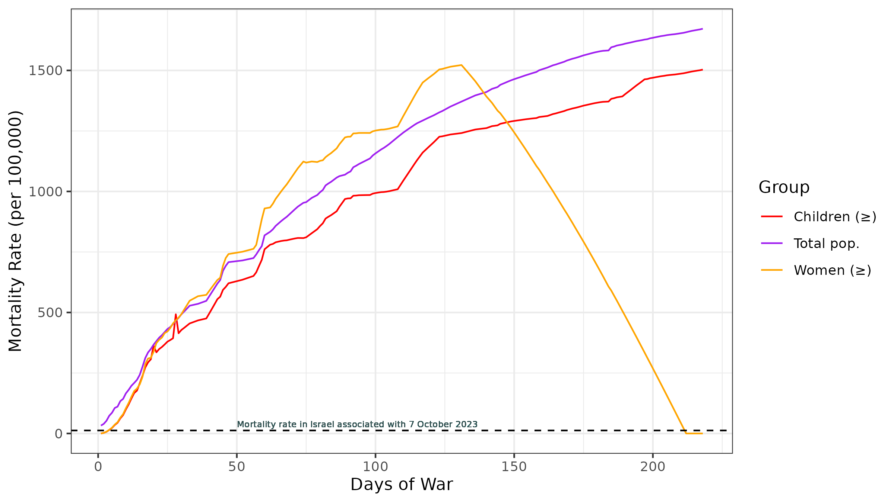

Tracking mortality in Palestine following Israel's assault against Gaza (2023-2024). 
*Last updated 6 April 2024*

# Gaza Conflict Tracker

This repository tracks daily deaths in Palestine in the conflict between Israel and Gaza following the attack by Hamas forces on 7 October 2023 against Israel.

## Background

According to [Wikipedia](https://en.wikipedia.org/wiki/2023_Hamas-led_attack_on_Israel), on 7 October 2023, the paramilitary wings of Hamas, Palestinian Islamic Jihad, PRC, PFLP, and DFLP launched a series of coordinated armed incursions into the Gaza envelope of the neighboring Israeli territory.

Israel retaliated with airstrikes in Gaza on 9 October 2023 and launched a ground invasion on 27 October 2023.

## Data Source

The data in this repository are sourced from the [Aljazeera live tracker](https://www.aljazeera.com/news/longform/2023/10/9/israel-hamas-war-in-maps-and-charts-live-tracker). However, only the data captured by archive.org (the [Wayback Machine](https://web.archive.org/web/20240000000000*/https://www.aljazeera.com/news/longform/2023/10/9/israel-hamas-war-in-maps-and-charts-live-tracker)) were used. Unlike the Alzajeera live tracker, the changes over time are tracked by archive.org and open to verification.

There are numerous days on which no updates were available. Nonetheless, in the raw data in the repository, the static data are repeated for every day for which no update is available but a snapshot of day's live tracker was recorded on the Wayback Machine.

Interpolated deaths and injuries could be estimated for non-reporting days.

## Data Description

The data in the tracker include cumulative deaths and injuries since the start of the war. These data focus exclusively on casualties in Palestine due to their predominance and the predominantly civilian nature of those deaths.

The 1,139 people killed in Israel since October 7 should not be diminished or forgotten.

## Repository Structure

The repository is structured as follows:
- `code/`: The directory contains R files for reading the raw tracker data, generating modeled data and saving the data in various formats. There is also a file for generating some basic visualisations of the data.
- `data/`: The directory contains the raw tracker data from the Aljazeera site as well as those data in various formats with modeled data to cover periods of poorly updated information. The available that include the modeled data are R (gaza_data.Rds) and Stata (gaza_data.sav). The raw data is in Excel 2007 format (mortality_data.xlsx).

- `images/`: Directory containing visualisations generated from the data.

## Overview

Figure 1 is an area  plot of the cumulative daily deaths since the commencement of the 
Gaza war. These figures are based on the modeled results from the Al Jazeera 
reporting.  The figures for women and children reflect deaths of "at least" that
magnitude. The deaths of men reflect deaths that are strictly less than the 
number shown.  The total, however, is correctly reported.

<strong>Figure 1:</strong> Cumulative daily deaths for children, women, and men.

Figure 2 is line graph of the mortality rate (per 100,000) for women, children,
and the total. The denominator population was obtained from the US Census Bureau's
International Database. For children the rate was calculated using the population
of those under 18; for women, it was the population of females 18+; the total
mortality rate is the crude mortality rate.

<strong>Figure 2:</strong> Mortality rate.

## Contributing

Contributions to this project are welcome. If you have suggestions for improvements or would like to contribute additional analyses or data (such as time-series of lost infrastructure), please feel free to open an issue or submit a pull request.

## License

This project is licensed under the [Gnu Public Licence version 3](https://www.gnu.org/licenses/quick-guide-gplv3.html). Further details are available in the LICENSE file on this repository.
